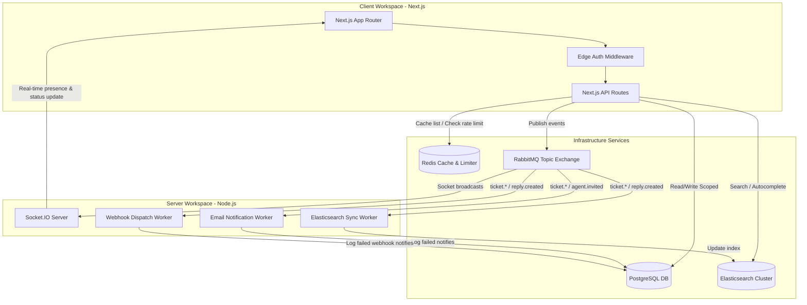

# AI-Powered Multi-Tenant SaaS Helpdesk

A full-stack, event-driven, multi-tenant SaaS support helpdesk platform. Businesses can register as tenants, manage support ticket lifecycles, communicate in real-time, search tickets using Elasticsearch, and retrieve streaming AI reply suggestions.

---

## 🔍 Code Review Guides (Two Important Resources)

To help you review this codebase efficiently, we have prepared two comprehensive walk-through guides:

1. **[Codebase Architecture Flow Map (`architecture.md`)](file:///Users/lakshaybansal/code/personal/wallt_assingment/architecture.md):** A step-by-step, file-by-file execution map tracing how a request travels through the middleware, route handlers, validators, services, repositories, database client, RabbitMQ event exchange, and background workers.
2. **[Individual Module Deep-Dives (`docs/`)](file:///Users/lakshaybansal/code/personal/wallt_assingment/docs/index.md):** A dedicated folder containing individual, deep-dive specification sheets for each core module (e.g. `auth.md`, `tenant_isolation.md`, `redis_caching.md`, `elasticsearch.md`, `ai_suggestions.md`, `webhooks.md`, `rabbitmq.md`, etc.). Each document details the module's architecture, multi-module connection interfaces, and engineering design trade-offs. *See [docs/index.md](file:///Users/lakshaybansal/code/personal/wallt_assingment/docs/index.md) for the recommended step-by-step reading sequence.*

---

## 🏗️ System Topology



---

## 🛠️ Tech Stack

* **Framework:** Next.js 16 (App Router) & Tailwind CSS + ShadCN UI
* **Database & ORM:** PostgreSQL with Prisma ORM
* **Caching Layer:** Redis (used for list query caches, details cache, and sliding window rate limits)
* **Message Broker:** RabbitMQ (decouples ticket dispatches, invitations, and indexing workflows)
* **AI Engine:** Google Gemini 2.5 Flash, Groq Llama 3.3, and Nvidia DeepSeek R1 (with fallback chain logic)
* **Real-time Server:** Standalone Node/TypeScript Socket.IO server (Port 3001)
* **Search Engine:** Elasticsearch v7.13.0 (Bonsai Cloud integration with edge-ngram autocomplete analyzer)
* **Testing Suite:** Vitest (14 passing unit and integration tests)

---

## 🚀 Local Installation & Setup

### Option A: Run via Docker Compose (Recommended)
You can boot the entire stack (PostgreSQL, Redis, RabbitMQ, Next.js App, Websockets, and Workers) in a single command.

1. **Copy the environment configuration template:**
   ```bash
   cp .env.example .env
   ```
2. **Build and start all services:**
   ```bash
   docker compose up --build -d
   ```
3. **Run database migrations inside the client container:**
   ```bash
   docker exec -it helpdesk_client npx prisma migrate deploy
   docker exec -it helpdesk_client npx prisma db seed
   ```
4. **Access the application:**
   * Frontend Application: [http://localhost:3000](http://localhost:3000)
   * Websocket Gateway: [http://localhost:3001](http://localhost:3001)
   * RabbitMQ Management: [http://localhost:15672](http://localhost:15672) (User/Pass: guest/guest)

---

### Option B: Local Manual Running

1. **Install All Workspace Dependencies:**
   ```bash
   npm install
   ```
2. **Configure Local Environment Files:**
   * Copy `client/.env.example` to `client/.env` and update connection details.
   * Copy `server/.env.example` to `server/.env` and update connection details.
3. **Migrate and Seed Database:**
   ```bash
   npm run prisma:migrate
   npm run prisma:seed
   ```
4. **Start the Stack in Development Mode:**
   * Run Client: `npm run dev:client` (Port 3000)
   * Run Socket Server: `npm run dev:server` (Port 3001)
   * Run Workers: `npm run worker`

---

## 🧪 Running Automated Tests

We have implemented **14 unit and integration tests** using Vitest covering API routes, token handshakes, tenant boundaries, rate limit sliding windows, and worker dispatchers.

Run all tests from the root directory:
```bash
npm run test
```

---

## 🧹 Workspace & Docker Cleanup

To completely clean up the local environment (delete all dependencies, Next.js build caches, server distribution files, and purge all Docker containers, networks, volumes, and images):
```bash
npm run clean
```

---

## 🌱 Demo Accounts (Pre-Seeded)

The database seeder prepares two tenants (Acme Corp and Wayne Enterprises) containing default credentials for instant validation:

* **Admin Account (Tenant A - Acme Corp):**
  * **Email:** `admin@tenant-a.com`
  * **Password:** `Demo@1234`
  * **Role:** `ADMIN`
* **Agent Account (Tenant A - Acme Corp):**
  * **Email:** `agent@tenant-a.com`
  * **Password:** `Demo@1234`
  * **Role:** `AGENT`

* **Admin Account (Tenant B - Wayne Enterprises):**
  * **Email:** `admin@tenant-b.com`
  * **Password:** `Demo@1234`
  * **Role:** `ADMIN`
