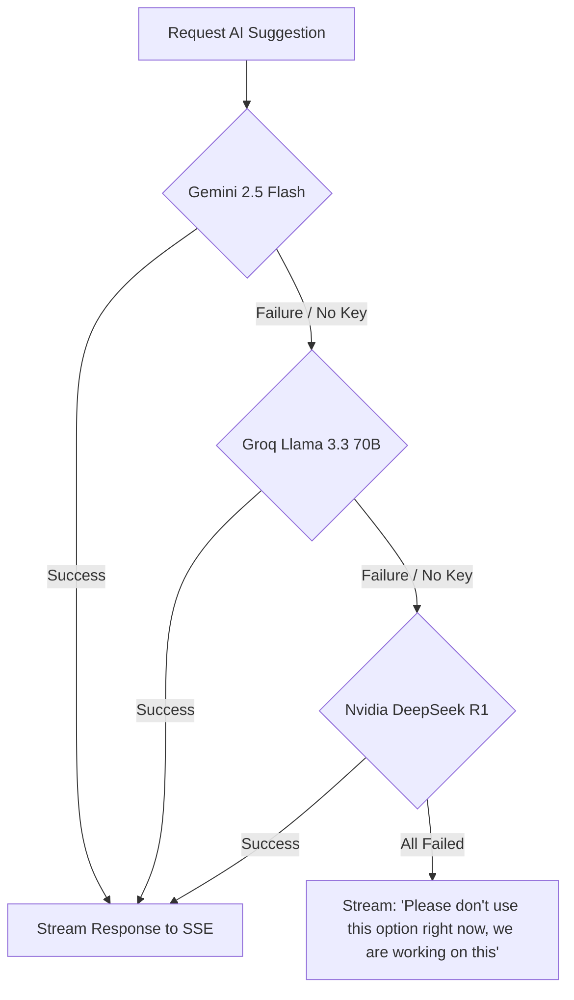

# AI Reply Suggestions & Server-Sent Events (SSE) Streaming

This document describes the design, implementation, and multi-LLM fallback architecture of the AI Draft Suggestion Engine.

---

## Technical Files & Scoping Context

- **Orchestration Client:** [ai.ts](file:///Users/lakshaybansal/code/personal/wallt_assingment/client/src/lib/ai.ts) — Dynamic fallback chain mapping Gemini, Groq, and Nvidia DeepSeek APIs.
- **SSE Stream Router:** [route.ts](file:///Users/lakshaybansal/code/personal/wallt_assingment/client/src/app/api/tickets/%5Bid%5D/suggest/route.ts) — Authenticates, checks rate limits, pulls thread history context, and streams responses.
- **Frontend AI View Component:** [page.tsx](file:///Users/lakshaybansal/code/personal/wallt_assingment/client/src/app/tickets/%5Bid%5D/page.tsx) — Component rendering the streamed tokens in real-time.

---

## The Resilient Fallback Pattern (Saga/Chain)

If a provider fails or API keys are missing, the system catches the exception and immediately transitions to the next available provider.



---

## Server-Sent Events (SSE) Streaming

The suggest route returns a standard `text/event-stream` response, allowing the Next.js API route to push tokens to the browser as they are generated.

- **System Context Prompt:** The prompt feeds the active support guidelines, tenant category description, the ticket title, and previous replies history to the LLM to write replies that match the context.
- **Stream Generation:** 
  The AI client yields tokens using an `AsyncGenerator`:
  ```typescript
  const responseStream = await getAiSuggestionStream(systemPrompt, userPrompt);
  const stream = new ReadableStream({
    async start(controller) {
      const encoder = new TextEncoder();
      for await (const chunk of responseStream) {
        controller.enqueue(encoder.encode(`data: ${JSON.stringify({ text: chunk })}\n\n`));
      }
      controller.close();
    }
  });
  return new NextResponse(stream, {
    headers: {
      'Content-Type': 'text/event-stream',
      'Cache-Control': 'no-cache, no-transform',
      'Connection': 'keep-alive',
      'X-Accel-Buffering': 'no' // Prevents proxy buffering
    }
  });
  ```

- **Frontend Consumption:** 
  The frontend uses standard `fetch` and reads from the stream reader:
  ```typescript
  const reader = response.body?.getReader();
  const decoder = new TextDecoder();
  while (true) {
    const { value, done } = await reader.read();
    if (done) break;
    const chunk = decoder.decode(value);
    // Parse SSE lines (data: { "text": "..." })
  }
  ```

---

## 🔗 Connection with Other Modules

- **Redis Rate Limiting:** Before launching the stream, the route checks the tenant's hourly rate limit. If it's valid, a token is consumed. If the stream encounters a failure midway, a refund is issued to Redis.
- **Postgres / Database:** Queries the `Ticket`, `Tenant`, and `TicketReply` tables to build a prompt rich in context (e.g. including the tenant description and the past conversation thread).
- **Ticket Thread UI:** Renders the suggestions panel, allowing agents to copy the suggested text directly into the reply box.

---

## ⚖️ Module Trade-offs & Decisions

### 1. Server-Sent Events (SSE) vs. WebSockets for Streaming
* **Decision:** We used SSE (HTTP-based unidirectional stream) instead of WebSockets.
* **Pros:** Simpler network routing, operates over standard HTTP/1.1 or HTTP/2, natively supports browser client reconnection, and integrates with Next.js edge-compatible stream APIs without setting up a permanent Socket connection on the frontend.
* **Cons:** Unidirectional. The client cannot send messages back to the server over the same stream (they must issue a separate POST request if needed).

### 2. Multi-LLM Provider Fallback Chain vs. Fixed Single Provider
* **Decision:** Sequentially chaining Gemini Flash, Llama 70B, and DeepSeek R1 instead of locking into a single AI provider.
* **Pros:** Highly resilient. If one model or API provider experiences an outage, the system automatically falls back to alternative networks without dropping the client request.
* **Cons:** Latency. The initial fallback detection check can delay the time-to-first-token for the agent. We minimized this by executing fast timeout checks on the active provider connection.
