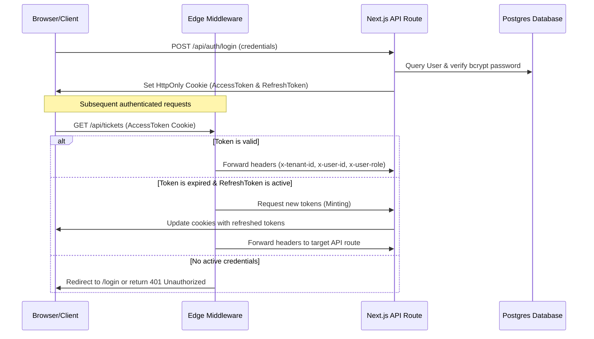

# Multi-Tenant Authentication (JWT + Refresh Token + httpOnly Cookies)

This document describes the design, implementation, and cryptographic topology of the stateless token-based multi-tenant authentication system.

---

## Technical Components & Files

- **Token Utilities:** [auth.ts](file:///Users/lakshaybansal/code/personal/wallt_assingment/client/src/lib/auth.ts) — Signed token creation & parsing using the edge-compatible `jose` library.
- **Middleware Guard:** [middleware.ts](file:///Users/lakshaybansal/code/personal/wallt_assingment/client/src/middleware.ts) — Route interceptor to validate JWTs, auto-refresh tokens, and forward tenant scoping headers.
- **Signup API Handler:** [route.ts](file:///Users/lakshaybansal/code/personal/wallt_assingment/client/src/app/api/auth/signup/route.ts) — Tenant & administrator onboarding route.
- **Login API Handler:** [route.ts](file:///Users/lakshaybansal/code/personal/wallt_assingment/client/src/app/api/auth/login/route.ts) — Password hashing validation and cookie generation.
- **Logout API Handler:** [route.ts](file:///Users/lakshaybansal/code/personal/wallt_assingment/client/src/app/api/auth/logout/route.ts) — Clears authentication cookies.

---

## Architectural Workflow

The system utilizes two JWT tokens to separate authentication lifecycle stages:
1. **Access Token (Short-lived: 15 minutes):** Stateless token containing user credentials, role, and tenant IDs. Used for route authorization.
2. **Refresh Token (Long-lived: 7 days):** Utilized by Next.js Edge Middleware to mint fresh access tokens when they expire without forcing a re-login.

---

## 🔗 Connection with Other Modules

- **Next.js Edge Middleware:** Directly intercepts incoming HTTP requests, decodes the cookies, validates the payload signature, and writes request headers forwarded to API routes.
- **Database & Prisma ORM:** Interacts with the `User` and `Tenant` tables to query credentials and persist new organizational signups.
- **Agent Management (`/api/users`):** The onboarded users are automatically assigned to the active administrator's `tenantId` checked via the JWT session.
- **Websockets (Socket.IO server):** During the WebSocket handshake, the client passes the JWT access token in the query or authorization headers. The Socket.IO server parses this token to associate the socket connection with the appropriate `tenantId` and `userId`.

---

## ⚙️ Security Details

- **Cryptographic Hashing:** User passwords are encrypted on signup/import using `bcryptjs` with a salt factor of 10.
- **Cookie Security Attributes:**
  - `HttpOnly`: Prevents client-side scripts (JavaScript) from accessing tokens, mitigating Cross-Site Scripting (XSS) risks.
  - `Secure`: Ensures cookies are only transmitted over TLS/HTTPS connections.
  - `SameSite=Strict`: Restricts cookie dispatches on cross-site requests to prevent Cross-Site Request Forgery (CSRF).
- **Graceful Token Refresh:** Next.js Edge Middleware automatically intercepts calls, inspects the expiration timestamp of the `accessToken` cookie, and uses the `refreshToken` to silently request a refresh endpoint, keeping user sessions uninterrupted.

---

## ⚖️ Module Trade-offs & Decisions

### 1. Stateless JWTs vs. Stateful Session Tables
* **Decision:** We used stateless JWTs instead of storing active sessions in the database or Redis.
* **Pros:** Scalable; API routes do not need to query the database/Redis on every single HTTP request just to verify the user is logged in.
* **Cons:** Token revocation is harder. If a user is deleted or disabled, their access token remains valid for up to 15 minutes unless an explicit blacklist cache is maintained in Redis. We chose to mitigate this by checking the database only for mutation requests.

### 2. Edge-Compatible `jose` vs. Standard `jsonwebtoken`
* **Decision:** We utilized the `jose` library for JWT handling instead of Node's built-in `jsonwebtoken`.
* **Pros:** Runs cleanly inside Next.js Edge Middleware, which has limited support for Node APIs (V8 isolates).
* **Cons:** Slightly different API footprint and less documentation compared to standard library.

### 3. Bcrypt Work Factor Selection (Salt Rounds = 10)
* **Decision:** Set bcrypt hashing rounds to 10.
* **Pros:** Balances verification speed (~50-100ms on server) with high cryptographic resistance to brute-force attacks.
* **Cons:** High iterations could lead to latency under massive concurrent login loads.
