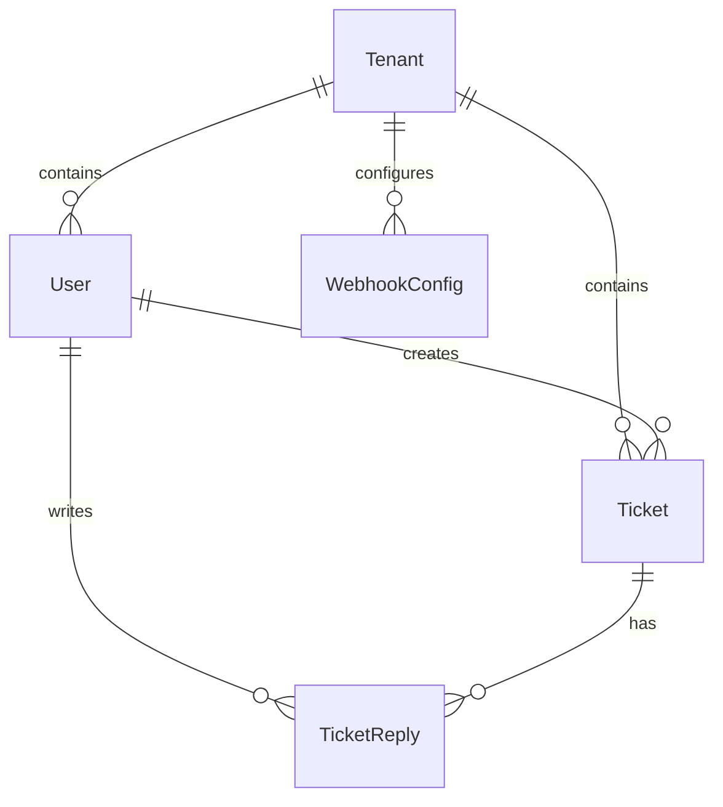

# PostgreSQL, Prisma ORM & Database Seeding

This document describes the relational database structure, model mappings, and automated seeding configuration.

---

## Technical Files & Scoping Context

- **Prisma Schema Mappings:** [schema.prisma](file:///Users/lakshaybansal/code/personal/wallt_assingment/client/prisma/schema.prisma) — Database schema definition.
- **Database Client Singleton:** [prisma.ts](file:///Users/lakshaybansal/code/personal/wallt_assingment/client/src/lib/prisma.ts) — Client helper preventing connection leaks.
- **Onboarding Seeder:** [seed.ts](file:///Users/lakshaybansal/code/personal/wallt_assingment/client/prisma/seed.ts) — Populates demo accounts, organizations, and initial ticket threads.

---

## The Relational Database Schema Model

The database represents a multi-tenant helpdesk containing key relational connections:

- **`Tenant`:** The top-level isolation boundary (stores description and industry category).
- **`User`:** User accounts representing support administrators or agents. Links to `Tenant` and contains login credentials (hashed passwords) and roles.
- **`Ticket`:** Support ticket records. Contains parameters like `status` (OPEN, IN_PROGRESS, RESOLVED, CLOSED) and `priority` (LOW, MEDIUM, HIGH, URGENT). Links to `Tenant`, `creator` (User), and `assignedTo` (User).
- **`TicketReply`:** Threads associated with a support ticket.
- **`FailedNotification`:** DLQ logs to trace failed worker transmissions.

---

## 🔗 Connection with Other Modules

- **Authentication System:** Directly maps `User` roles (`Role` enum) and verified `tenantId` parameters.
- **Ticket APIs:** Performs database query reads, inserts, and updates scoped strictly via Prisma relations.
- **Websockets & RabbitMQ Workers:** Background consumers fetch model instances (e.g., ticket creators, assignees) by executing queries through the global `prisma` singleton.
- **Analytics Dashboards:** The admin analytics page runs custom aggregations (e.g. `$queryRaw` calculations) directly against these relational tables to compute metrics.

---

## ⚖️ Module Trade-offs & Decisions

### 1. Prisma ORM vs. Raw SQL (Query Builders)
* **Decision:** We used Prisma ORM for core CRUD operations and raw SQL (`$queryRaw`) only for complex analytics aggregations.
* **Pros:** Rapid development, automatic type generation, easy migrations, and high safety guards against SQL injection.
* **Cons:** Overhead in query performance. Prisma generates complex SQL queries and fetches complete model trees unless fields are explicitly excluded. We resolved this by manually defining `select` criteria in nested queries and using raw queries for the analytics dashboard.

### 2. Prisma Client Singleton vs. Instantiate-on-Demand
* **Decision:** Implemented a single `PrismaClient` instance exported from `prisma.ts`.
* **Pros:** Prevents database connection pool exhaustion. Next.js hot-reloading during development spins up new modules, which could otherwise initialize dozens of client instances and block Postgres ports.
* **Cons:** A global singleton can make isolated mocking of the DB layer during testing harder. We handled this by creating isolated database seed states during integration tests.
