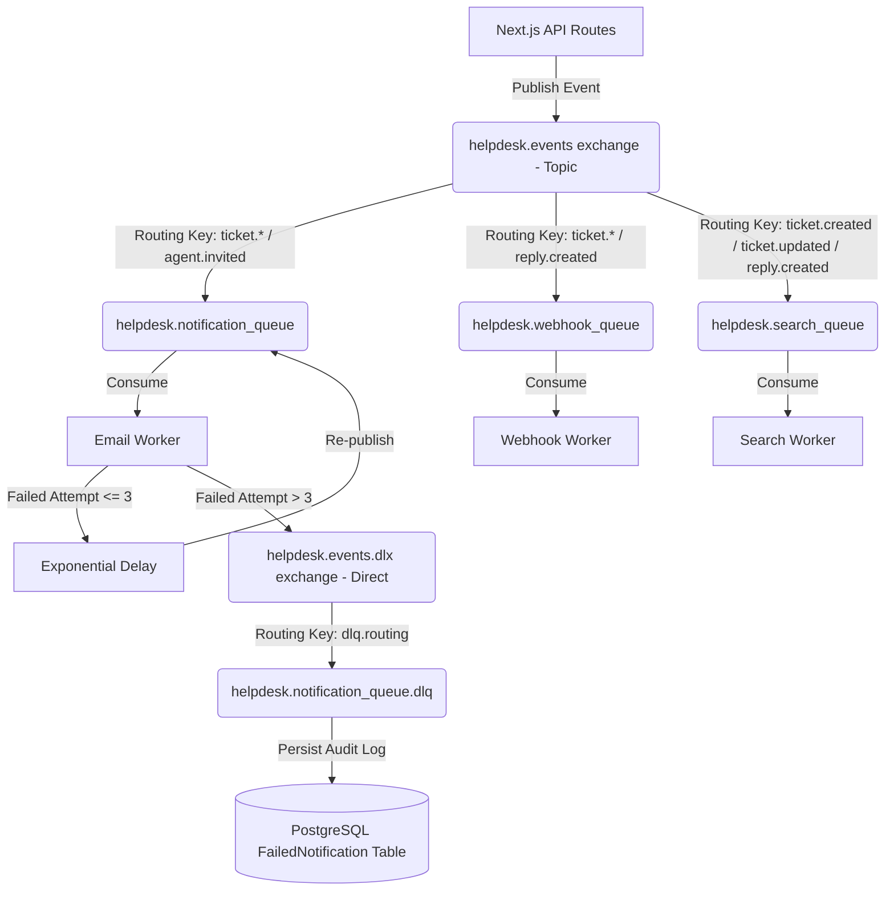

# RabbitMQ Event Publishing, Workers & Dead Letter Queues (DLQ)

This document describes the asynchronous event-driven architecture that powers background workers, notification dispatches, and Elasticsearch synchronization.

---

## Technical Files & Scoping Context

- **Event Publisher Module:** [rabbitmq.ts](file:///Users/lakshaybansal/code/personal/wallt_assingment/client/src/lib/rabbitmq.ts) — Connection pooling module to publish events to RabbitMQ.
- **Workers Controller Runner:** [runAll.ts](file:///Users/lakshaybansal/code/personal/wallt_assingment/server/workers/runAll.ts) — Bootstraps all consumers.
- **Email Consumer Worker:** [emailWorker.ts](file:///Users/lakshaybansal/code/personal/wallt_assingment/server/workers/emailWorker.ts) — Dispatches SMTP email notifications.
- **Search Sync Worker:** [searchWorker.ts](file:///Users/lakshaybansal/code/personal/wallt_assingment/server/workers/searchWorker.ts) — Synced indexing engine for Elasticsearch.
- **Webhook Dispatch Worker:** [webhookWorker.ts](file:///Users/lakshaybansal/code/personal/wallt_assingment/server/workers/webhookWorker.ts) — Dispatches webhooks.

---

## Architectural Topology

---

## Resiliency Features

### 1. Reconnection Resilience
All consumer worker scripts include `'close'` and `'error'` event listeners on the connection objects. If a network disruption or a RabbitMQ server heartbeat timeout occurs, the workers automatically schedule a reconnect loop every 5 seconds instead of crashing.

### 2. Exponential Backoff Retry Policy
If an event processing attempt fails (e.g., SMTP transport timeout or webhook endpoint down), the workers intercept the exception, increment a custom `'x-retry-count'` header, and delay the message. The retry delay escalates exponentially:
$$\text{delay} = \text{BASE\_DELAY\_MS} \times 2^{\text{retryCount}}$$

### 3. Dead Letter Queue Isolation
Once a message exhausts its maximum retries (e.g., 3 attempts):
1. The consumer worker logs the failure and writes an audit record into the `FailedNotification` PostgreSQL database table under the tenant's isolated space.
2. The consumer rejects the message (`channel.nack(msg, false, false)`), directing it to the Dead Letter Exchange (DLX) and quarantining it in the Dead Letter Queue (DLQ).

---

## 🔗 Connection with Other Modules

- **API Route Handlers:** Whenever tickets are created/updated or replies are posted, the handlers publish events to the `helpdesk.events` topic exchange.
- **PostgreSQL Database:** In case of persistent failures, the DLQ logs the failure metrics to the `FailedNotification` table scoped by the tenant ID, allowing admins to view error logs in the Admin Room UI.
- **Elasticsearch Search Index:** The `searchWorker.ts` uses RabbitMQ events to execute automated document creates, updates, and Painless array appends.
- **Socket.IO Real-time Server:** The WebSocket server listens to the `ticket.*` and `reply.created` events to broadcast real-time status chips and new messages directly to corresponding active agent rooms.

---

## ⚖️ Module Trade-offs & Decisions

### 1. Topic Exchange vs. Direct Exchange
* **Decision:** We used a RabbitMQ Topic Exchange (`helpdesk.events`) with wildcard routing keys (e.g., `ticket.*`) instead of a Direct Exchange.
* **Pros:** Highly flexible. A single event (like `ticket.created`) can be routed to multiple independent queues (Email queue, Webhook queue, Search indexing queue) automatically by the broker. We can add new background consumers in the future without modifying the publishing API route.
* **Cons:** Slightly more complex binding logic.

### 2. Dead-Letter Queue (DLQ) vs. Auto-Discard
* **Decision:** We route persistently failing messages to a DLQ and log them in PostgreSQL rather than discarding them immediately.
* **Pros:** Highly transparent. If an SMTP server goes offline for hours, emails are not lost. Administrators can view the failed reasons, resolve credentials, and plan manual recoveries.
* **Cons:** Requires a database table write and extra broker routing configurations.

### 3. Dedicated Background Workers vs. In-Line Thread Processing
* **Decision:** Decoupling side-effects into separate Node background processes instead of executing them inline inside the Next.js API handler thread.
* **Pros:** Extreme responsiveness. The API returns `201 Created` to the client in ~20ms, while heavy tasks like sending SMTP emails (which takes 1-2 seconds) are deferred.
* **Cons:** Increased system infrastructure complexity. We need to run, manage, and monitor the worker processes alongside the main application.
