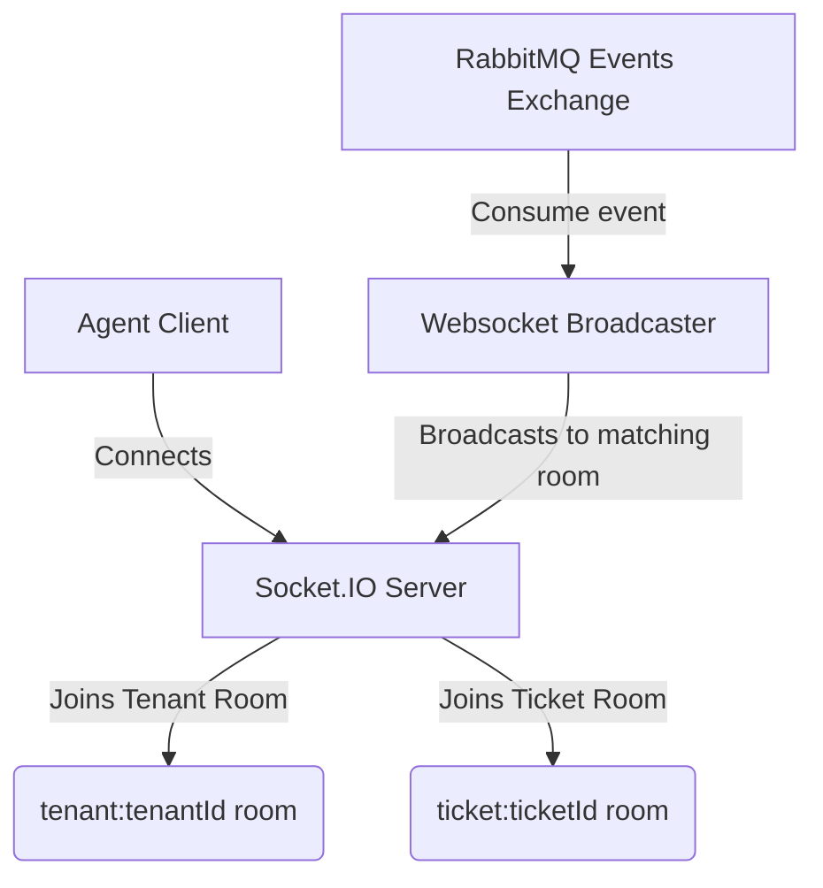

# Socket.IO Real-Time Updates & Room-Based Communication

This document describes the design, implementation, and room scoping channels of the real-time Socket.IO WebSocket server.

---

## Technical Files & Scoping Context

- **Socket.IO Server File:** [index.ts](file:///Users/lakshaybansal/code/personal/wallt_assingment/server/index.ts) — Express HTTP + Socket.IO server running on port `3001`. Handles connection authentication and broadcasts.
- **Frontend Dashboard Real-time:** [page.tsx](file:///Users/lakshaybansal/code/personal/wallt_assingment/client/src/app/dashboard/page.tsx) — Subscribes to tenant rooms to refresh the ticket grid and stats.
- **Frontend Thread Room Real-time:** [page.tsx](file:///Users/lakshaybansal/code/personal/wallt_assingment/client/src/app/tickets/%5Bid%5D/page.tsx) — Connects to individual ticket rooms to sync message timelines and status changes.

---

## Connection Flow & Security

To prevent unauthorized connection access:
1. **JWT Verification Handshake:** 
   Sockets are authenticated during the connection handshake. The client retrieves its verified token from the `/api/users/me` API and transmits it in the connection payload:
   ```typescript
   const socket = io(SOCKET_URL, { auth: { token } });
   ```
2. **Backend Authentication:**
   The Socket.IO server interceptor validates the token using the shared `JWT_SECRET`. If signature checks fail or the token has expired, the connection is rejected:
   ```typescript
   const token = socket.handshake.auth.token;
   const { payload } = await jwtVerify(token, JWT_SECRET);
   socket.data = { userId: payload.userId, tenantId: payload.tenantId, role: payload.role };
   ```

---

## Room Scoping Topology

To enforce strict separation of real-time feeds, the server organizes connections into dedicated channels:



- **Tenant Rooms (`tenant:${tenantId}`):**
  Used to broadcast high-level mutations. When a ticket is created or modified, the server receives the RabbitMQ event and emits a `ticket:created` or `ticket:updated` socket broadcast strictly to that tenant room. This updates other active agents' dashboard layouts and stats in real-time.
- **Ticket Detail Rooms (`ticket:${ticketId}`):**
  When a user views a ticket thread room, their socket joins the specific ticket room. When a reply is posted (`reply.created` event), the socket server emits a `reply:created` broadcast to this channel. This appends the new message to the thread timeline immediately.

---

## Active Presence Tracking

The Socket.IO server tracks active connections inside ticket rooms to build the "Active Users Presence" widget:
- When a user joins the ticket room, the server maps their socket ID to their user profile.
- The server emits an `active-users` broadcast listing the active agents viewing the same ticket.
- When a client disconnects or leaves the page, the server removes the user and updates the list.

---

## 🔗 Connection with Other Modules

- **RabbitMQ Message Queue:** The Socket.IO server acts as a background consumer subscribing to RabbitMQ events (`ticket.*`, `reply.created`). When an event is consumed, it translates the payload and pushes it to corresponding Socket.IO rooms.
- **Frontend Ticket Timeline:** React clients subscribe to websocket rooms to immediately push new messages into state, bypassing periodic HTTP polling.
- **Agent Presence Widget:** Synchronizes with database client models to display active agent avatars and active reader rosters.

---

## ⚖️ Module Trade-offs & Decisions

### 1. Dedicated WebSocket Server vs. Next.js App Router WebSockets
* **Decision:** We built a standalone Node/Express server for Socket.IO on port `3001` instead of using Next.js routes to stream sockets.
* **Pros:** Highly stable. Next.js serverless functions (like Vercel lambdas) are stateless and timeout quickly, making it difficult to maintain persistent TCP sockets. A standalone node server keeps sockets open forever.
* **Cons:** Runs on a separate port/domain, which requires CORS configurations and separate deployment infrastructure. We mitigated this by setting CORS controls dynamically based on variables.

### 2. RabbitMQ-to-Socket.IO Synchronization vs. DB-Level Triggers
* **Decision:** Propagating events to Sockets using RabbitMQ messages instead of polling PostgreSQL or using database triggers.
* **Pros:** Low latency and minimal DB overhead. RabbitMQ processes and pushes events to the socket server in less than 5ms without issuing a single database read.
* **Cons:** Requires a running RabbitMQ broker. If RabbitMQ is down, real-time sync halts (though the application falls back safely to page refreshes).
