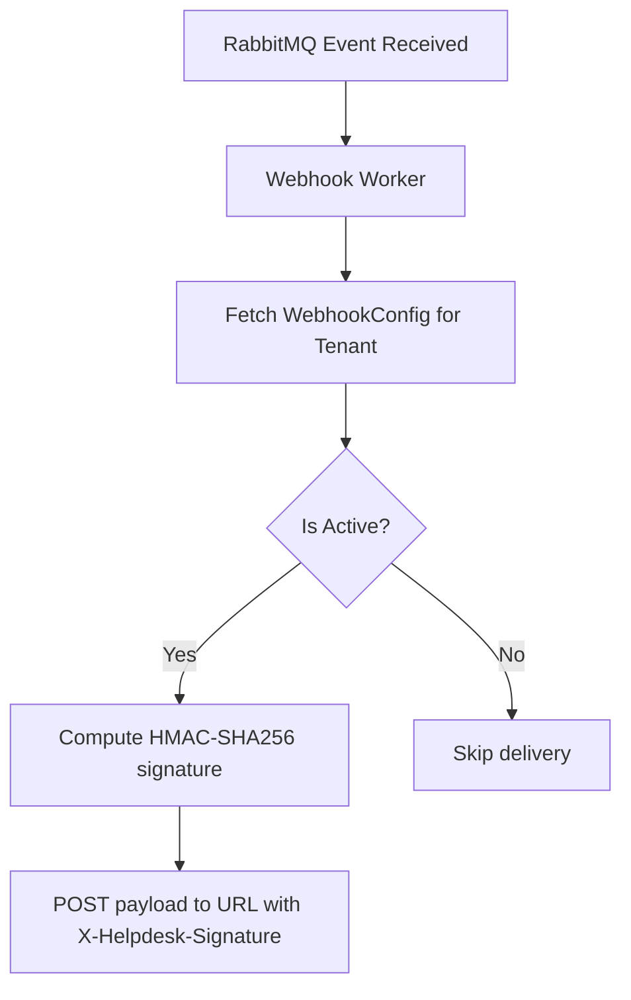

# Webhooks Delivery Engine

This document describes the design, implementation, and cryptographic signature of the Webhook dispatch system, showing how it pushes real-time events to external URLs securely.

---

## Technical Files & Scoping Context

- **Prisma Schema Configuration:** [schema.prisma](file:///Users/lakshaybansal/code/personal/wallt_assingment/client/prisma/schema.prisma) — Defines the `WebhookConfig` model.
- **Admin Configuration Route:** [route.ts](file:///Users/lakshaybansal/code/personal/wallt_assingment/client/src/app/api/admin/webhooks/route.ts) — Secure admin endpoint to get and save webhook details under tenant scoping.
- **Webhook Dispatch Worker:** [webhookWorker.ts](file:///Users/lakshaybansal/code/personal/wallt_assingment/server/workers/webhookWorker.ts) — Background consumer that computes HMAC signatures and POSTs payloads.

---

## Webhook Database Schema

Webhook URLs and secrets are configured per tenant and stored in the database:
```prisma
model WebhookConfig {
  id        String   @id @default(uuid())
  url       String
  isActive  Boolean  @default(true)
  secret    String   // Hex-encoded signing secret
  tenantId  String   @unique
  tenant    Tenant   @relation(fields: [tenantId], references: [id])
  createdAt DateTime @default(now())
}
```

When a tenant configures their webhook for the first time, the API automatically generates a secure, random **32-byte hex-encoded HMAC secret**.

---

## Webhook Signature Verification Flow (HMAC SHA-256)

To protect target endpoints from spoofing, all webhook request payloads are cryptographically signed using the tenant's secret:



- **Payload Format:** Webhook dispatches are sent via `POST` with a JSON body containing the event type, timestamp, and payload:
  ```json
  {
    "event": "ticket.created",
    "timestamp": "2026-06-17T00:39:12.456Z",
    "data": { ... }
  }
  ```
- **HMAC Signature Calculation:**
  ```typescript
  const payloadStr = JSON.stringify(webhookPayload);
  const signature = crypto.createHmac('sha256', secret).update(payloadStr).digest('hex');
  ```
- **Header:** Sent as `X-Helpdesk-Signature: sha256=<signature>`.
- **Target Verification:** The target server receives the request, computes the HMAC SHA-256 hash of the raw request body using the shared secret, and compares it to the signature in the header. If they match, the payload is verified as authentic.

---

## 🔗 Connection with Other Modules

- **RabbitMQ Message Queue:** Listens to ticket and reply events (`ticket.created`, `ticket.updated`, `reply.created`) bound to the `helpdesk.webhook_queue` queue.
- **Admin Configuration Portal:** Administrators manage their webhook endpoints and copy their generated signing secrets under the Admin Room webhooks configuration panel.
- **Postgres Database:** Persists configuration settings (`WebhookConfig`) and logs delivery errors to the `FailedNotification` table in case of retry exhaustion.

---

## ⚖️ Module Trade-offs & Decisions

### 1. Cryptographic HMAC Signing vs. Simple Token Authentication
* **Decision:** We used HMAC-SHA256 payload signing (`X-Helpdesk-Signature`) instead of sending a simple static authorization token header.
* **Pros:** Secure. If a static token header is intercepted, an attacker can spoof requests forever. With HMAC, the signature changes with every single request body. Even if an attacker intercepts a payload, they cannot modify the payload (like ticket ID or status) because the signature would mismatch.
* **Cons:** Requires target servers to implement body-parsing and HMAC cryptographic verification.

### 2. Immediate POST vs. Queue-Buffered Dispatch
* **Decision:** Buffering webhook events in a dedicated RabbitMQ queue (`helpdesk.webhook_queue`) instead of executing direct HTTP calls during REST mutations.
* **Pros:** Webhook target URLs are notorious for timeouts and slow response times. Queuing ensures that slow external endpoints never block internal helpdesk APIs or agent screens.
* **Cons:** Slight data latency. Webhooks are delivered asynchronously (usually within 10-100ms) rather than instantly during database writes.
